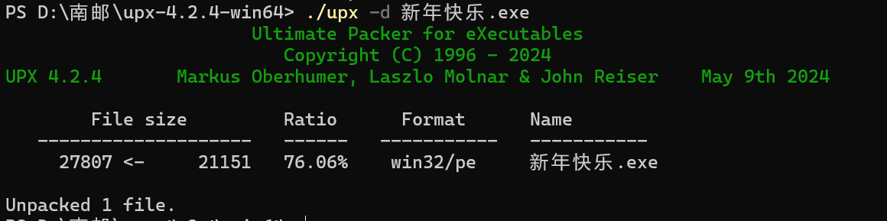
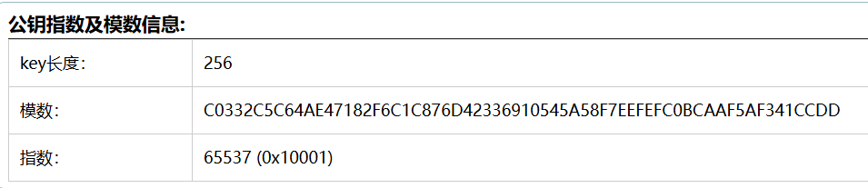

# 学习成果

## BUUCTF

### 新年快乐

1. 查壳工具显示为32位加了upx壳

2. 进行脱壳处理  用IDA打开找到main入口转化成伪代码分析

大概意思输入一个字符串如果和str2相同 就是flag

strcpy函数相当于复制字符串到数组

strncmp函数比较字符串相同则输出0

memset函数相当于初始化数组

str1就是str2    flag{HappyNewYear}

---

### rsa

1. 

2. 模数是16进制的转换一下n=86 934 482 296 048 119 190 666 062 003 494 800 588 905 656 017 203 025 617 216 654 058 378 322 103 517

   分解一下

   p=304008741604601924494328155975272418463

   q=285960468890451637935629440372639283459

3. 现已知p,q,n,e写脚本求解得到flag

---

### 刮开有奖

1. 查壳 ：无壳 32位 用C++编写

2. IDA打开找到WinMain入口            DialogBoxParamA传入一个函数作为参数创建对话框

3. **DialogFunc**是关键函数跟进一下

   最后if判断一堆条件都符合即得到flag，往前看**memset**先初始化String，**GetDlgItemTextA**把编辑框内容存放到String中

   String是8位的，初始化v7-v16, 看IDA的注释

   内存都差4个字节存放位置连续是一个数组

   **sub_4010F0**对v7数组进行一个处理 跟进一下

4. 

   是一个参数已知的函数转化成c直接编译，查询DWORD需要<windows.h>的头文件

   可以知道String的前两位即flag的前两位UJ

5. **sub_401000**函数是进行base64编码的

   用插件知道base64加密

   

6. 网站解码

   可以知道分别为String 的678位和345位

7. 得出flag{UJWP1jMp}

---

### luck guy

1. 查壳32位elf文件 IDa打开

2. 关键函数**patch_me**跟进

3. 关键**get_flag**跟进

4. 分析一下case1是找出flag最后一步，其中f1已知是GXY{do_not_}，f2为初始化后面的肯定是找出f2，case是对f2初始化，case5是对f2进行处理，外层for循环五次所以要找出flag顺序是 4 5 1

5. case4把f2初始化为icug`of **注意这里最后有一个空白符**这样f2才是8位

6. case5处理

   得到f2

7. case1     strcat((char *)&s, f1);                
                   strcat((char *)&s, &f2);

    GXY{do_not_hate_me}

   得到flag

---

### 简单注册器

1. 用jadx打开找到主要入口

   需要让第一个if语句判断条件全不成立。字符串是32位，第32位是a·第二位是b·第1+第3=104对应ascii码相加是104，一个是52对应char是4

   第二个if语句分析内容进行了一系列处理最后输出flag

2. 

得到flag

---

### findit

1. 同上用jdx打开

   

   求y java运行得到flag

---

### 不一样的flag（迷宫）

1. 第一个if语句解释了输入1234的情况

2. 第二个if语句保证了数组不会越界
3. 三四个if：遇到1是会退出，知道遇到#时正确即最后一个
4. 222441144222找到了

---

### java逆向解密

1. 输入flag进行Encrypt操作最后于result比较相等就是正确的
2. 写脚本得到flag

---

### xor

对b数组里的元素进行异或运算

跟进getline函数

read 函数是返回读取的字节数  猜测getline与scanf作用类似

重要的就是for循环的异或运算

两次异或运算等于没有异或找出原来输入的flag

要比较的数据提取一下

应该还有一个b[0]所以flag是flag{QianQiuWanDai_YiTongJiangHu}

---

### SimpleRev

1. 跟进关键函数Decry

**重要的是ida处理过的数据是正序的二位代码里的是逆序**

join函数和下两行的作用相同得出

text是killshadow

key是ADSFKNDCLS

2. 分析for循环

   if成立的条件是key[v3]是A到Z的，那么就加32转化成小写字母

   其实作用就是把大写字母改成小写的

3. 下面的while最终目的就是处理str2

4. 写脚本对照ascii码表把text反退回str2

   枚举法

   

   

   得到flag

---

---

## 其他

### 1.rsa加密

| 步骤 | 说明                     | 描述             |
| ---- | ------------------------ | ---------------- |
| 1    | 一对不相等且足够大的质数 | p，q             |
| 2    | 计算pq乘积               | n=p*q            |
| 3    | 计算n的欧拉函数          | φ(n)=(q-1)*(p-1) |
| 4    | 选一个与φ(n)互质的整数e  | 1<e<φ(n)         |
| 5    | 计算e对φ(n)的模反元素d   | de mod φ(n)=1    |
| 6    | 公钥                     | KU=(e,n)         |
| 7    | 私钥                     | KU=(d,n)         |

明文M  密文C
$$
加密 M^emodn=C
$$

$$
解密 C^d modn=M
$$

欧拉函数是小于n的正整数中与n互质的数目

模反元素：两个正整数e和φ(n)互质，一定可以找到一个d使得ed-1被φ(n)整除/ed除以φ(n)余数是1

---

### 2.搭建linux虚拟机

用VM搭建了centos7

---

### 3.Android逆向知识

1. apk相当于一个压缩包，解压后res文件夹存放资源文件：布局按钮等.其中layout放布局文件，menu存放菜单的布局，drawable图片布局。INF是apk签名文件，还有清单文件
2. smali是Android虚拟机的反汇编语言

---

### 4.小端序存储

字节存储顺序分为大端序和小端序

大端序：高位字节存入低地址（正序）

小端序：低位字节存入高地址（逆序）

